# 📊 BGMS Database Architecture Guide

이 문서는 BGMS 프로젝트의 전체 데이터베이스 구조와 각 테이블의 상세 용도를 설명합니다.

## 1. 데이터베이스 관계도 (ERD)

```mermaid
erDiagram
    match_master_telemetry ||--o{ processed_match_telemetry : "contains"
    match_master_telemetry ||--o{ match_stats_raw : "has participants"
    match_master_telemetry ||--o{ global_benchmarks : "sampled for"
    global_benchmarks ||--o{ benchmark_stats_by_tier : "aggregates"
    pubg_player_cache ||--o{ processed_match_telemetry : "searched by"
    
    profiles ||--o{ posts : "writes"
    posts ||--o{ comments : "has"
    posts ||--o{ post_likes : "receives"
    profiles ||--o{ notifications : "receives"
    
    categories ||--o{ map_markers : "groups"
    map_markers ||--o{ pending_markers : "submission"
    map_settings ||--o{ map_markers : "configures"

    agent_runs ||--o{ agent_steps : "records"
    agent_runs ||--o{ agent_approvals : "requests"
    agent_steps ||--o{ agent_approvals : "may require"
    agent_memories ||--o{ agent_runs : "informs"

    crate_templates ||--o{ crate_items : "contains"
    crate_templates ||--o{ prime_parcel_items : "contains"
    crate_templates ||--o{ bonus_items : "rewards"

    weapons ||--o{ attachments : "accepts"
    weapons ||--o{ ammo : "uses"

    match_master_telemetry ||--o{ match_ai_coaching_cache : "summarized by"
    pubg_player_cache ||--o{ player_ai_summary_cache : "summarized by"
    pubg_player_cache ||--o{ squad_ai_coaching_cache : "squad cached by"
```

## 2. 도메인별 테이블 상세 설명

### ⚔️ 전술 분석 도메인 (Tactical Analytics)
| 테이블명 | 용도 | 설명 |
| :--- | :--- | :--- |
| **`processed_match_telemetry`** | **전술 분석 결과 캐시** | 분석 엔진이 처리한 최종 데이터(JSON)를 저장하여 재연산을 방지합니다. `RESULT_VERSION`에 따라 관리됩니다. |
| **`match_master_telemetry`** | **경기 메타데이터** | 분석된 매치의 기본 정보(시간, 맵, 버전)와 텔레메트리 파일 경로(S3/Storage)를 저장합니다. |
| **`global_benchmarks`** | **글로벌 벤치마크 지표** | 티어 판별(S~D)의 기준이 되는 전 세계 유저들의 평균 전술 스탯을 샘플링하여 저장합니다. |
| **`benchmark_stats_by_tier`** | **티어별 벤치마크 뷰/집계** | 매치 분석과 AI 요약에서 티어별 비교 기준을 빠르게 조회합니다. |
| **`match_stats_raw`** | **참가자 기본 통계** | 특정 매치에 참여한 모든 플레이어의 기본 스탯(딜량, 킬, 순위 등)을 저장합니다. |
| **`pubg_player_cache`** | **플레이어 검색/전적 캐시** | Nickname, AccountId, 플랫폼, 클랜, 무기 숙련도(`weapon_mastery_data`, `mastery_updated_at`)를 저장합니다. |
| **`pubg_api_errors`** | **PUBG API 장애 이력** | PUBG API 실패 route/status/message를 기록해 운영 진단과 파트너 리포트에 사용합니다. |
| **`pubg_api_status`** | **PUBG API 호출 한도 상태** | PUBG API rate limit header를 저장해 남은 호출량과 reset 시점을 추적합니다. |

### 🗺️ 맵 에디터 도메인 (Map Editor)
| 테이블명 | 용도 | 설명 |
| :--- | :--- | :--- |
| **`map_markers`** | **맵 마커 데이터** | 맵 위에 표시되는 각종 지형물(비밀의 방, 차량 스폰 등)의 GPS 좌표와 상세 정보를 저장합니다. |
| **`map_settings`** | **맵 레이어 설정** | 에란겔, 미라마 등 각 맵별 기본 설정(최대 줌, 타일 이미지 경로 등)을 관리합니다. |
| **`hotdrop_heatmap`** | **핫드랍 데이터** | 플레이어들의 낙하 위치 데이터를 좌표화하여 시각적인 히트맵 정보를 제공합니다. |
| **`categories`** | **마커 카테고리** | 마커의 종류(SecretRoom, Vehicle, Lab 등)를 계층적으로 분류합니다. |
| **`pending_markers`** | **승인 대기 마커** | 유저가 제보한 새로운 마커 정보가 관리자 승인 전까지 머무르는 공간입니다. |
| **`sync_history`** | **데이터 동기화 이력** | 맵 에디터 데이터의 외부 배포 또는 내부 업데이트 이력을 기록합니다. |

### 💬 커뮤니티 및 유저 (Community & Auth)
| 테이블명 | 용도 | 설명 |
| :--- | :--- | :--- |
| **`profiles`** | **유저 프로필** | 서비스 가입 유저의 정보와 대표 PUBG 닉네임, 플랫폼, 권한(Admin/User)을 관리합니다. |
| **`posts`** | **게시글** | 커뮤니티 게시판의 글 제목, 내용, 작성자 정보를 저장합니다. |
| **`comments`** | **댓글** | 게시글에 달린 답변과 피드백 데이터를 저장합니다. |
| **`post_likes`** | **좋아요** | 특정 게시글에 대한 유저들의 추천 여부를 관리합니다. |
| **`notifications`** | **시스템 알림** | 댓글 작성, 좋아요 수신 등 유저에게 전달되는 활동 알림입니다. |

### 🤖 Admin Agent 및 운영 자동화 (Admin Agent)
| 테이블명 | 용도 | 설명 |
| :--- | :--- | :--- |
| **`agent_runs`** | **Agent 실행 기록** | 관리자 AI 비서, monitor, rollout, self-test 등 Agent 실행 단위를 기록합니다. |
| **`agent_steps`** | **Agent 단계 기록** | 실행 중 호출한 도구, 안전 등급, 입력 파라미터, 결과/오류를 단계별로 저장합니다. |
| **`agent_approvals`** | **위험 작업 승인 큐** | 게시글 발행, 캐시 삭제, 대량 수정 같은 위험 작업의 승인/거절/실행 결과를 저장합니다. |
| **`agent_memories`** | **운영 메모리** | 반복 이슈, 해결책, 운영 지식, 다음 대응 힌트를 저장합니다. |
| **`ai_usage_logs`** | **AI 비용/토큰 기록** | Gemini/AI SDK 호출의 토큰 사용량, 비용, 기능명을 추적해 비용 진단에 사용합니다. |

### 📦 도감/시뮬레이터 데이터 (Game Data)
| 테이블명 | 용도 | 설명 |
| :--- | :--- | :--- |
| **`weapons`** | **무기 도감 데이터** | 무기 기본 정보, 이미지 키, 탄약/타입 등 도감과 가방 시뮬레이터에서 쓰는 기준 데이터입니다. |
| **`attachments`** | **부착물 데이터** | 부착물 도감과 가방 시뮬레이터에서 쓰는 부착물 기준 데이터입니다. |
| **`ammo`** | **탄약 데이터** | 탄약 무게/종류 등 가방 시뮬레이터 계산에 필요한 기준 데이터입니다. |
| **`consumables`** | **소모품 데이터** | 회복/부스트 아이템의 무게와 메타데이터를 저장합니다. |
| **`throwables`** | **투척물 데이터** | 투척류 아이템의 무게와 메타데이터를 저장합니다. |
| **`vehicles`** | **차량 데이터** | 차량 도감/가방 시뮬레이터 보조 데이터입니다. |
| **`crate_templates`** | **상자 템플릿** | 상자 시뮬레이터에서 상자별 이름, 가격, 구성 메타데이터를 관리합니다. |
| **`crate_items`** | **상자 아이템 풀** | 상자별 획득 가능 아이템과 확률/등급 정보를 저장합니다. |
| **`prime_parcel_items`** | **프라임 파셀 아이템** | 프라임 파셀 계열 보상 아이템 정보를 저장합니다. |
| **`bonus_items`** | **보너스 상점 아이템** | 보너스 상점/이벤트 보상 아이템 정보를 저장합니다. |

### 🧠 AI 캐시 및 운영 캐시 (AI Cache)
| 테이블명 | 용도 | 설명 |
| :--- | :--- | :--- |
| **`match_ai_coaching_cache`** | **매치 AI 코칭 캐시** | 단일 매치 AI 분석 결과를 재사용해 비용과 응답 시간을 줄입니다. |
| **`player_ai_summary_cache`** | **플레이어 AI 요약 캐시** | 여러 매치 기반 플레이어 요약 결과를 캐시합니다. |
| **`squad_ai_coaching_cache`** | **스쿼드 AI 코칭 캐시** | 스쿼드/팀 분석 AI 결과를 캐시합니다. |
| **`sync_history`** | **외부 동기화 이력** | 패치노트, 맵 데이터 등 외부 데이터 동기화 상태를 기록합니다. |

---

## 3. 핵심 데이터 흐름
1. **분석 흐름**: `PUBG API` -> `match_master_telemetry` -> `Telemetry Parsing` -> `processed_match_telemetry` 저장.
2. **벤치마크 흐름**: `scrape_elite.ts` -> `global_benchmarks` 수집 -> `Stat Analysis` 시 티어 비교군으로 활용.
3. **무기 마스터리 흐름**: `pubg_player_cache.id(accountId)` -> PUBG `weapon_mastery` 1회 호출 -> `pubg_player_cache.weapon_mastery_data` 저장.
4. **Agent 승인 흐름**: `/admin/bot` -> `agent_runs`/`agent_steps` 기록 -> 위험 작업은 `agent_approvals` 대기 -> 승인 후 실행 결과 저장.
5. **AI 비용 관리 흐름**: AI 호출 -> `ai_usage_logs` 기록 -> Admin Agent monitor가 비용 임계치와 사용량을 점검합니다.
6. **캐싱 전략**: 무거운 연산 결과는 `processed_match_telemetry`, R2, AI 캐시 테이블에 저장되어 재조회 시 즉각적인 응답을 보장합니다.
