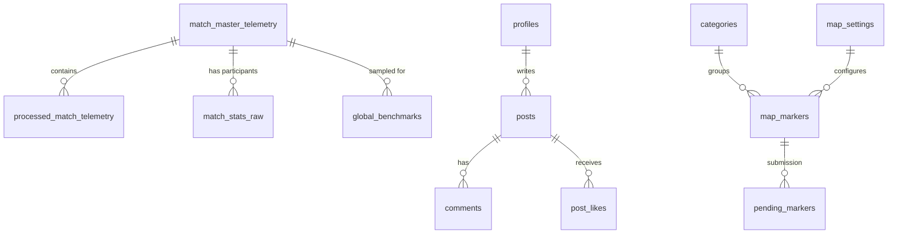

# 📊 BGMS Database Architecture Guide

이 문서는 BGMS 프로젝트의 전체 데이터베이스 구조와 각 테이블의 상세 용도를 설명합니다.

## 1. 데이터베이스 관계도 (ERD)

## 2. 도메인별 테이블 상세 설명

### ⚔️ 전술 분석 도메인 (Tactical Analytics)
| 테이블명 | 용도 | 설명 |
| :--- | :--- | :--- |
| **`processed_match_telemetry`** | **전술 분석 결과 캐시** | 분석 엔진이 처리한 최종 데이터(JSON)를 저장하여 재연산을 방지합니다. `RESULT_VERSION`에 따라 관리됩니다. |
| **`match_master_telemetry`** | **경기 메타데이터** | 분석된 매치의 기본 정보(시간, 맵, 버전)와 텔레메트리 파일 경로(S3/Storage)를 저장합니다. |
| **`global_benchmarks`** | **글로벌 벤치마크 지표** | 티어 판별(S~D)의 기준이 되는 전 세계 유저들의 평균 전술 스탯을 샘플링하여 저장합니다. |
| **`match_stats_raw`** | **참가자 기본 통계** | 특정 매치에 참여한 모든 플레이어의 기본 스탯(딜량, 킬, 순위 등)을 저장합니다. |
| **`pubg_player_cache`** | **플레이어 검색 인덱스** | 검색된 플레이어의 Nickname과 AccountId를 매핑하여 저장하며, 자동완성 기능을 지원합니다. |

### 🗺️ 맵 에디터 도메인 (Map Editor)
| 테이블명 | 용도 | 설명 |
| :--- | :--- | :--- |
| **`map_markers`** | **맵 마커 데이터** | 맵 위에 표시되는 각종 지형물(비밀의 방, 차량 스폰 등)의 GPS 좌표와 상세 정보를 저장합니다. |
| **`map_settings`** | **맵 레이어 설정** | 에란겔, 미라마 등 각 맵별 기본 설정(최대 줌, 타일 이미지 경로 등)을 관리합니다. |
| **`hotdrop_heatmap`** | **핫드랍 데이터** | 플레이어들의 낙하 위치 데이터를 좌표화하여 시각적인 히트맵 정보를 제공합니다. |
| **`categories`** | **마커 카테고리** | 마커의 종류(SecretRoom, Vehicle, Lab 등)를 계층적으로 분류합니다. |
| **`pending_markers`** | **승인 대기 마커** | 유저가 제보한 새로운 마커 정보가 관리자 승인 전까지 머무르는 공간입니다. |
| **`sync_history`** | **데이터 동기화 이력** | 맵 에디터 데이터의 외부 배포 또는 내부 업데이트 이력을 기록합니다. |

### 💬 커뮤니티 및 유저 (Community & Auth)
| 테이블명 | 용도 | 설명 |
| :--- | :--- | :--- |
| **`profiles`** | **유저 프로필** | 서비스 가입 유저의 정보와 대표 PUBG 닉네임, 플랫폼, 권한(Admin/User)을 관리합니다. |
| **`posts`** | **게시글** | 커뮤니티 게시판의 글 제목, 내용, 작성자 정보를 저장합니다. |
| **`comments`** | **댓글** | 게시글에 달린 답변과 피드백 데이터를 저장합니다. |
| **`post_likes`** | **좋아요** | 특정 게시글에 대한 유저들의 추천 여부를 관리합니다. |
| **`notifications`** | **시스템 알림** | 댓글 작성, 좋아요 수신 등 유저에게 전달되는 활동 알림입니다. |

---

## 3. 핵심 데이터 흐름
1. **분석 흐름**: `PUBG API` -> `match_master_telemetry` -> `Telemetry Parsing` -> `processed_match_telemetry` 저장.
2. **벤치마크 흐름**: `scrape_elite.ts` -> `global_benchmarks` 수집 -> `Stat Analysis` 시 티어 비교군으로 활용.
3. **캐싱 전략**: 모든 무거운 연산 결과는 `processed_match_telemetry`에 저장되어 재조회 시 즉각적인 응답을 보장합니다.
